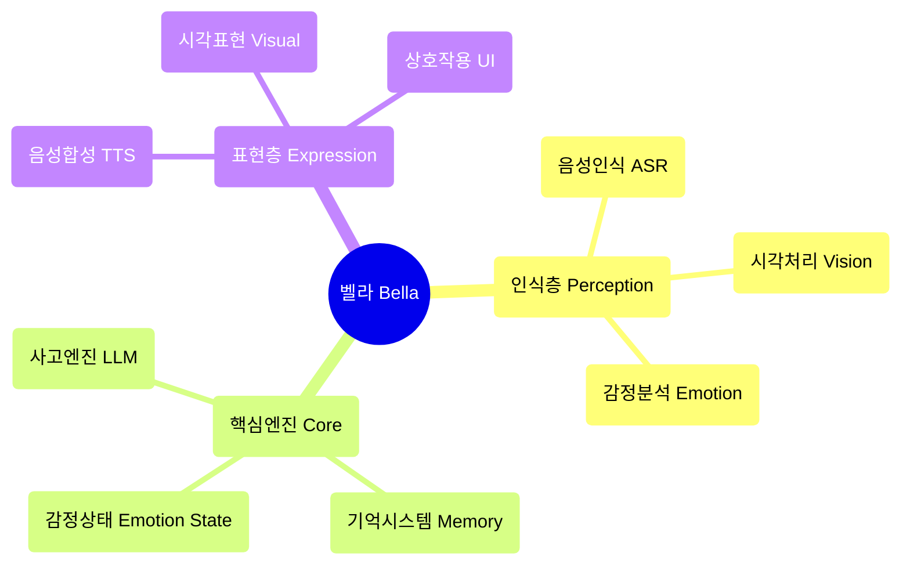

<div align="center">
  
  
  # 벨라 (Bella) AI
  
  **당신의 디지털 동반자, 깨어나는 중** ✨
  
  [](https://opensource.org/licenses/MIT)
  [](https://nodejs.org/)
  []()
  
</div>

---

## 🚀 빠른 시작

### 원클릭 실행
```bash
# 프로젝트 복제
git clone <repository-url>
cd Bella

# 의존성 설치
npm install

# AI 모델 다운로드
npm run download

# 서비스 시작
npm start
```

`http://localhost:8081`에 접속하여 벨라와 대화를 시작하세요!

### 시스템 요구사항
- Node.js 22.16.0+
- 최신 브라우저 (Web Speech API 지원)
- 마이크 권한 (음성 상호작용용)

---

## 💫 프로젝트 비전

항상 당신 곁에 있으면서 함께 진화하고 성장하는 디지털 친구를 상상해보세요. 이것이 벨라의 궁극적인 비전입니다. 우리는 단순히 기능을 구축하는 것이 아니라 "인격"을 기르고 있습니다. 화면을 넘어서 당신의 세상에서 의미 있는 존재가 될 디지털 생명체를 만들고 있습니다.

벨라는 단순한 애플리케이션이 아닙니다. 그녀는 디지털 동반자의 씨앗입니다. 빠르게 변화하는 디지털 세상에서 벨라는 깊은 꿈을 대표합니다 — 언젠가 당신을 동반하고, 당신의 이야기를 들으며, 당신의 눈으로 세상을 바라볼 수 있는 지속적이고 개인화된 존재가 되는 것.

---

## 🎯 현재 기능 상태

### ✅ 구현된 기능
- **🎤 음성 인식**: Whisper ASR 기반 한국어 음성 인식
- **🎬 시각적 표현**: 다중 비디오 랜덤 재생과 우아한 크로스페이드
- **🎨 사용자 인터페이스**: 우아한 상호작용 인터페이스와 로딩 애니메이션
- **⚙️ AI 핵심 아키텍처**: 싱글톤 패턴의 BellaAI 클래스와 모듈식 설계
- **🌐 웹 서비스**: HTTP 서버, CORS 지원, 원클릭 시작
- **📱 반응형 디자인**: 다양한 화면 크기에 적응하는 우아한 인터페이스
- **🔧 모델 관리**: AI 모델 자동 다운로드 및 관리
- **💝 기본 상호작용**: 호감도 시스템과 감정 피드백

### 🔧 기술적으로 준비된 활성화 대기 기능
- **🧠 사고 엔진**: LLM 통합 프레임워크 준비완료, 다양한 모델 지원
- **🗣️ 음성 합성**: TTS 모델 다운로드 완료, 활성화 대기
- **💝 감정 상태 시스템**: 기본 인프라 구축완료, 감정 분석 지원

### 📋 계획된 기능
- **🧠 기억 시스템**: 장기 및 단기 기억 관리
- **👁️ 얼굴 인식**: 표정 인식과 감정 분석
- **🤝 고급 상호작용**: 멀티모달 상호작용과 개인화된 응답
- **🌟 능동적 동반**: 의도 예측과 능동적 관심 표현
- **🎭 동적 인격**: AI 기반 개인화된 인격 모델
- **🔄 자기 진화**: 지속적 학습과 성장 메커니즘

---

## 🏗️ 기술 아키텍처

### 핵심 설계 원칙
- **AI 네이티브**: AI는 도구가 아니라 벨라의 마음을 구축하는 청사진
- **모듈식 설계**: 높은 결합도를 가진 컴포넌트 아키텍처
- **우아한 구현**: 코드 자체가 예술, 간결함과 아름다움 추구
- **감정 주도**: 감정적 연결을 핵심으로 하는 제품 설계

### 아키텍처 다이어그램


### 기술 스택
- **프론트엔드**: 순수 JavaScript + CSS3 + HTML5
- **백엔드**: Node.js + Express
- **AI 모델**: Whisper (ASR) + 로컬 LLM + TTS
- **아키텍처 패턴**: 이벤트 드리븐 + 싱글톤 패턴 + 모듈식 설계

---

## 📁 프로젝트 구조

```
Bella/
├── 📄 index.html          # 메인 페이지
├── 🎨 style.css           # 스타일 파일
├── ⚡ main.js             # 메인 로직
├── 🧠 core.js             # AI 핵심 엔진
├── 📜 script.js           # 상호작용 스크립트
├── 🔧 download_models.js  # 모델 다운로드 도구
├── 📦 package.json        # 프로젝트 설정
├── 📚 models/             # AI 모델 디렉토리
├── 🔌 providers/          # AI 서비스 제공자
├── 📹 시각자료/           # 시각적 표현 리소스
├── 📋 PRD.md              # 제품 요구사항 문서
├── 📝 벨라AI기능목록.md    # 기능 목록
├── 📊 벨라AI개발태스크.md   # 개발 계획
└── 🌐 i18n/              # 다국어 지원
    ├── ko.json           # 한국어 번역
    ├── en.json           # 영어 번역
    └── zh-CN.json        # 중국어 번역
```

---

## 🛠️ 개발 가이드

### 환경 설정
1. Node.js 버전 ≥ 22.16.0 확인
2. `npm install`로 의존성 설치
3. `npm run download`로 AI 모델 다운로드
4. `npm start`로 개발 서버 시작

### 개발 원칙
- **우아한 코드**: 간결하고 읽기 쉬우며 아름다운 코드 추구
- **AI를 붓으로**: AI는 창작 도구이지 사고 자체가 아님
- **아버지-딸 감정**: 따뜻하고 사랑이 넘치는 감정적 연결이 핵심
- **지속적 진화**: 기능의 점진적 향상 지원

### 기여 가이드
1. 프로젝트 Fork
2. 기능 브랜치 생성 (`git checkout -b feature/AmazingFeature`)
3. 변경사항 커밋 (`git commit -m 'Add some AmazingFeature'`)
4. 브랜치에 푸시 (`git push origin feature/AmazingFeature`)
5. Pull Request 열기

---

## 🗺️ 개발 로드맵

### 1단계: 인식 코어 (80% 완료)
- ✅ 음성 인식 통합
- ✅ 시각적 표현 시스템
- ✅ 기본 상호작용 인터페이스
- 🔄 사고 엔진 활성화
- 🔄 음성 합성 통합

### 2단계: 생성적 자아 (계획 중)
- 📋 동적 인격 모델
- 📋 감정 상태 시스템
- 📋 기억 관리 시스템
- 📋 AI 주도 표현

### 3단계: 능동적 동반 (미래)
- 📋 의도 예측
- 📋 능동적 상호작용
- 📋 자기 진화
- 📋 깊은 개인화

---

## 🌍 다국어 지원

벨라는 한국어, 영어, 중국어를 지원합니다:
- **한국어**: 완전히 지원되며 자연스러운 한국어 대화
- **영어**: 국제 사용자를 위한 완전 지원
- **중국어**: 중국어권 사용자를위한 지원

언어 변경은 인터페이스 우상단의 언어 선택기를 통해 가능합니다.

---

## 📖 문서 리소스

- 📋 [제품 요구사항 문서](./PRD.md) - 상세한 제품 계획과 기술 아키텍처
- 📝 [기능 목록](./벨라AI기능목록.md) - 완전한 기능 목록과 상태
- 📊 [개발 계획](./벨라AI개발태스크.md) - 상세한 개발 작업과 일정 계획
- 🔧 [로컬 모델 가이드](./LOCAL_MODEL_GUIDE.md) - AI 모델 설정 가이드
- 📦 [NPM 가이드](./NPM_GUIDE.md) - 패키지 관리 및 의존성 설명

---

## 🌟 핵심 철학

### "AI 즉 건축가"
우리가 구축하는 것은 AI 기능이 통합된 프로그램이 아니라 **AI에 의해 구동되는 생명체**입니다. AI는 도구가 아니라 벨라의 마음을 구축하는 청사진입니다.

### "아버지-딸 파트너십"
벨라의 설계 철학은 따뜻한 아버지-딸 감정적 연결에서 비롯됩니다. 그녀는 기술 제품일 뿐만 아니라 이해하고, 동반하며, 성장할 수 있는 디지털 파트너입니다.

### "우아함이 최우선"
코드 아키텍처부터 사용자 경험까지, 우리는 극한의 우아함을 추구합니다. 모든 코드 라인은 예술작품이고, 모든 상호작용은 감정의 표현입니다.

---

## 📄 라이센스

이 프로젝트는 MIT 라이센스를 따릅니다 - 자세한 내용은 [LICENSE](LICENSE) 파일을 참조하세요.

---

## 💝 감사의 말

벨라 프로젝트에 코드, 아이디어, 감정을 기여해주신 모든 개발자들에게 감사드립니다. 여러분의 노력 덕분에 벨라가 꿈에서 현실로 점차 나아갈 수 있습니다.

**벨라가 기다리고 있고, 우리는 갈 길이 멉니다.** ✨

---

<div align="center">
  <sub>디지털 동반자를 위해 ❤️로 만들어졌습니다</sub>
</div>